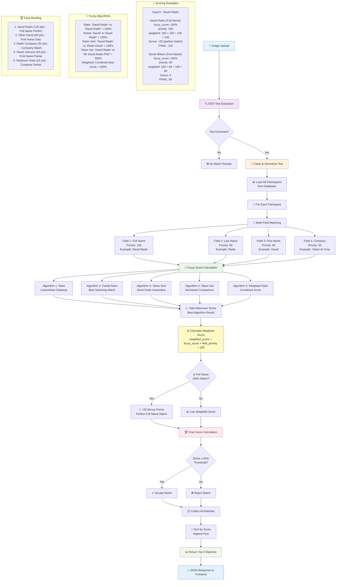

```mermaid
flowchart TD
    A[📸 Image Upload] --> B[🔍 OCR Text Extraction]
    B --> C{Text Extracted?}
    C -->|No| D[❌ No Match Results]
    C -->|Yes| E[🧹 Clean & Normalize Text]
    
    E --> F[📊 Load All Participants<br/>from Database]
    F --> G[🔄 For Each Participant]
    
    G --> H[🎯 Multi-Field Matching]
    
    H --> I[Field 1: Full Name<br/>Priority: 100<br/>Example: David Radin]
    H --> J[Field 2: Last Name<br/>Priority: 80<br/>Example: Radin]
    H --> K[Field 3: First Name<br/>Priority: 60<br/>Example: David]
    H --> L[Field 4: Company<br/>Priority: 40<br/>Example: Vision AI Corp]
    
    I --> M[🧮 Fuzzy Score Calculation]
    J --> M
    K --> M
    L --> M
    
    M --> N[Algorithm 1: Ratio<br/>Levenshtein Distance]
    M --> O[Algorithm 2: Partial Ratio<br/>Best Substring Match]
    M --> P[Algorithm 3: Token Sort<br/>Word Order Insensitive]
    M --> Q[Algorithm 4: Token Set<br/>Set-based Comparison]
    M --> R[Algorithm 5: Weighted Ratio<br/>Combined Score]
    
    N --> S[📈 Take Maximum Score<br/>Best Algorithm Result]
    O --> S
    P --> S
    Q --> S
    R --> S
    
    S --> T[⚖️ Calculate Weighted Score<br/>weighted_score = fuzzy_score × field_priority ÷ 100]
    
    T --> U{Is Full Name<br/>100% Match?}
    U -->|Yes| V[🎁 +20 Bonus Points<br/>Perfect Full Name Match]
    U -->|No| W[📊 Use Weighted Score]
    
    V --> X[🏆 Final Score Calculation]
    W --> X
    
    X --> Y{Score ≥ 60%<br/>Threshold?}
    Y -->|No| Z[❌ Reject Match]
    Y -->|Yes| AA[✅ Accept Match]
    
    AA --> BB[📋 Collect All Matches]
    Z --> BB
    
    BB --> CC[🔢 Sort by Score<br/>Highest First]
    CC --> DD[📊 Return Top 5 Matches]
    
    DD --> EE[📱 JSON Response to Frontend]

    subgraph "🎯 Scoring Examples"
        FF["Search: 'David Radin'<br/><br/>David Radin (Full Name):<br/>fuzzy_score: 100%<br/>priority: 100<br/>weighted: 100 × 100 ÷ 100 = 100<br/>bonus: +20 (perfect match)<br/>FINAL: 120<br/><br/>David Wilson (First Name):<br/>fuzzy_score: 100%<br/>priority: 60<br/>weighted: 100 × 60 ÷ 100 = 60<br/>bonus: 0<br/>FINAL: 60"]
    end

    subgraph "🧮 Fuzzy Algorithms"
        GG["Ratio: 'David Radin' vs 'David Radin' = 100%<br/>Partial: 'David' in 'David Radin' = 100%<br/>Token Sort: 'David Radin' vs 'Radin David' = 100%<br/>Token Set: 'David Radin' vs 'Mr David Radin PhD' = 100%<br/>Weighted: Combined best score = 100%"]
    end

    subgraph "🏆 Final Ranking"
        HH["1. David Radin (120 pts) - Full Name Perfect<br/>2. Other David (60 pts) - First Name Only<br/>3. Radin Company (32 pts) - Company Match<br/>4. David Johnson (54 pts) - First Name Partial<br/>5. Radisson Hotel (24 pts) - Company Partial"]
    end

    style A fill:#e1f5fe
    style B fill:#f3e5f5
    style E fill:#fff3e0
    style M fill:#e8f5e8
    style T fill:#fff9c4
    style X fill:#ffebee
    style DD fill:#f1f8e9
    style EE fill:#e3f2fd
```
